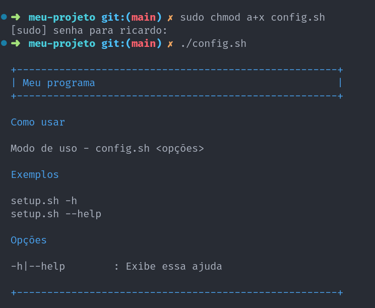

# Shelly

Este é um simples framework para criação de scripts bash, oferecendo diversas facilidades para implementação de ferramentas de configuração, instalação e afins.

## Como usar

Em um projeto qualquer, faça o clone deste framework em algum subdiretório de sua preferência:

```bash
git clone https://github.com/ricardopedias/shelly.git meu/shelly
```

## Criando um programa

Na raiz do projeto, crie um arquivo `.sh` contendo a seguinte implementação:

```bash
#!/bin/bash

# determina o caminho completo para este arquivo
ROOT_PATH=$(cd "$(dirname "${BASH_SOURCE[0]}")" &> /dev/null && pwd)

# inclui as funcionalidades do framework
source "$ROOT_PATH/meu/shelly/setup.sh"

# determina o arquivo .md que será usado para exibir ajuda
DSETUP_HELP_FILE="$ROOT_PATH/meu/help.md"

# padroniza a lista de argumentos passados pelo usuário
argumentList=$(prepareArgumentPairs $@)

for argumentPair in $argumentList
do
    paramKey=$(pairKey $argumentPair)
    paramValue=$(pairValue $argumentPair)

    # configura as opções para seus respectivos comandos
    case "$paramKey" in
        hello) echo "Olá mundo!" ;;

        *) 
            showError "Opção inválida: $paramKey"
            exitSuccess
            ;;
    esac
done
```

O programa acima, além das opções `-h` e `--help` padrões, também possui uma nova chamada `--hello`. Considerando que chamamos o arquivo `.sh` de `config.sh`, o uso será o seguinte:

```bash
./config.sh --hello
# exibe: Olá mundo!
```

## Criando um arquivo de ajuda

Por padrão, um arquivo de ajuda do framework é carregado, contendo somente as informações básicas sobre as opções `-h` e `--help`. A declaração da variável `$DSETUP_HELP_FILE` muda esse comportamento, possibilitando o carregamento de um arquivo de ajuda personalizado.

O arquivo deve ser no formato `markdown`, de forma que o título principal (começando com #) será desenhado como o "nome do programa" e os subtítulos (começando com ##) serão seções da ajuda.

O seguinte arquivo `.md` é um bom exemplo:

```md
# Meu programa

## Como usar

Modo de uso - config.sh <opções>

## Exemplos

setup.sh -h 
setup.sh --help

## Opções

-h|--help        : Exibe essa ajuda
--hello          : Exibe uma mensagem de Olá
```

Que será desenhado no terminal da seguinte forma:



## Ferramentas do framework

- Manipulando opções;
- Exibindo informações;
- Desenhando formas;
- Colorindo o terminal;
- Usando um tema específico;
- Caminhos absolutos;
- Barras de progresso;
- Formatando textos.

OBS: Embora as funcionalidades possuam testes de unidade, a respectiva documentação ainda será elaborada tão logo seja possível.

